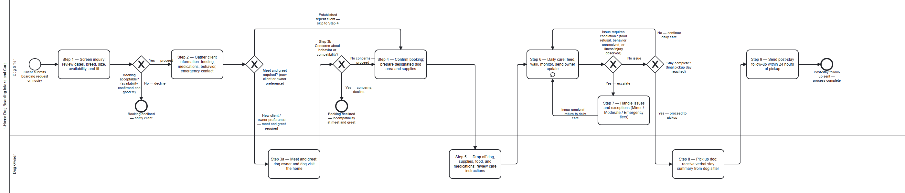

# In-Home Dog Boarding Intake and Care
## Process Package — Capstone Submission

**Consultant:** Jason Geanuracos
**Partner / Process Owner:** Abbey Cohen
**SOP Version:** 1.1
**Published:** 2026-04-07
**Partner Review:** Abbey Cohen confirmed v1.1 on 2026-04-12 — no concerns or modifications requested.
**Submitted:** 2026-04-19

---

## Contents

1. Written SOP
2. Process Diagram (BPMN)
3. Stakeholder Identification
4. Governance Notes
5. Improvement Recommendations

---

# Part I — Written SOP

## Standard Operating Procedure — In-Home Dog Boarding Intake and Care

**Version:** 1.1
**Published:** 2026-04-07
**DRI:** Abbey Cohen, Dog Sitter / Process Owner
**Next Review Date:** 2026-07-12 (quarterly per governance plan; or upon significant change to booking platform, care policies, or service scope)
**Change Summary:** v1.1 — Clarified Step 6/7 escalation model: Step 6 handles inline daily-loop resolutions only; explicit trigger line added for Step 7; Step 7 reframed as true escalation path with Minor/Moderate/Emergency tiers. Partner review complete: Abbey Cohen confirmed v1.1 on 2026-04-12 — no concerns or modifications requested. v1.0 — Initial draft based on Abbey Cohen's process outline.

---

### 1. Purpose

Standardize the intake, daily care, and completion process for in-home dog boarding services, ensuring consistent client communication, safe animal care, and reliable follow-through from initial inquiry to post-stay follow-up.

---

### 2. Scope

**Start Trigger:** A client submits a boarding request or inquiry via app, text, or direct message.

**End State:** The dog is safely returned to the owner, the boarding stay is complete, and a post-stay follow-up message has been sent.

#### In Scope

- Client inquiry screening and compatibility evaluation
- Information gathering and booking confirmation
- Meet and greet coordination (new clients or by request)
- Home environment preparation
- Drop-off procedures and care instruction review
- Daily care routines and owner communication
- Issue escalation and exception handling
- Pickup, stay summary, and post-stay follow-up

#### Out of Scope

- Marketing or client acquisition
- Financial transactions, payment processing, or deposits
- Veterinary care delivery (referral and authorization only)
- Care for animals other than dogs
- Booking platform administration

---

### 3. Roles & Responsibilities

| Role | Responsibilities |
|------|-----------------|
| **Dog Sitter (Abbey Cohen)** | Screen inquiries; gather client information; conduct meet and greet if needed; confirm booking; prepare home environment; provide daily care; communicate with owner throughout stay; manage exceptions; complete pickup and post-stay follow-up |
| **Dog Owner (Client)** | Submit booking request; provide care instructions, food, medications, and emergency contacts; drop off and pick up dog; respond to communications during the stay |

---

### 4. Prerequisites

- **Communication channel:** Booking app, text, or direct message accessible to dog sitter
- **Home environment:** Designated dog area prepared with necessary supplies before drop-off
- **Required client information** (must be collected before booking is confirmed):
  - Feeding schedule and food type
  - Medication instructions (if applicable)
  - Behavioral notes (aggression, anxiety, known triggers)
  - Emergency contact information

---

### 5. Inputs & Outputs

**Inputs:**

- Dog boarding request from client (app, text, or direct message)
- Dog care instructions (feeding schedule, behavior notes, daily routines)
- Dog food, leash, and medications (provided by owner at drop-off)
- Emergency contact information

**Outputs:**

- Completed boarding stay with daily owner updates
- Verbal stay summary provided at pickup (behavior, eating, activity)
- Post-stay follow-up message sent to client

---

### 6. Procedure

#### Step 1 — Receive and Screen Inquiry

**Actor:** Dog Sitter

Receive the booking request or inquiry from the client. Review the requested dates, dog breed, size, and care needs. Evaluate availability and compatibility with current schedule, home environment, and any other pets in the home.

> **Decision:** Is the booking acceptable — availability confirmed and a good fit?
> - **Yes:** Proceed to Step 2.
> - **No:** Decline the request and notify the client. End process.

---

#### Step 2 — Gather Client Information

**Actor:** Dog Sitter

Request and collect the following information from the owner:

- Feeding schedule and food type
- Medication instructions (if applicable)
- Behavioral traits (aggression, anxiety, known triggers)
- Emergency contact information

Clarify any missing or unclear details with the owner before confirming the booking.

*Exception: If any required information is incomplete, do not confirm the booking. Follow up with the owner until all details are received. See Exceptions table.*

---

#### Step 3 — Meet and Greet

**Actor:** Dog Sitter, Dog Owner

> **Decision:** Is a meet and greet required?
> - **New client or owner preference:** Proceed with Steps 3a–3b.
> - **Established repeat client, no concerns** *(determination at dog sitter's discretion):* Skip to Step 4.

**Step 3a — Schedule and Conduct Meet and Greet**

Coordinate a time for the owner and dog to visit. Observe the dog's behavior and interaction with the home environment. Confirm expectations, care routines, and any special needs with the owner.

**Step 3b — Evaluate Compatibility**

> **Decision:** Are there concerns about behavior or compatibility with the home environment?
> - **Yes:** Decline the booking. Explain the concern to the owner. End process.
> - **No:** Proceed to Step 4.

---

#### Step 4 — Confirm Booking and Prepare Environment

**Actor:** Dog Sitter

Confirm the final booking dates and care instructions with the owner. Before the drop-off date:

1. Clean and prepare the designated dog area.
2. Confirm all necessary supplies are on hand (food bowls, bedding, leash hook, etc.).
3. Note any medication schedule or behavioral reminders in a visible location.

---

#### Step 5 — Receive Dog at Drop-Off

**Actor:** Dog Sitter, Dog Owner

Receive the dog, supplies, food, and medications from the owner at drop-off. Review care instructions verbally. Confirm the following before the owner departs:

- Feeding schedule and food location
- Daily routines and exercise needs
- Emergency contact and preferred vet (if applicable)

---

#### Step 6 — Provide Daily Care

**Actor:** Dog Sitter

Repeat the following each day for the duration of the boarding stay:

1. Feed the dog according to the owner's schedule.
2. Provide walks, exercise, and attention appropriate to the dog's needs.
3. Monitor behavior, appetite, and overall health.
4. Send an update (photo and/or message) to the owner.

> **Decision:** Does the dog refuse food?
> - Retry at the next scheduled feeding time. If the dog eats at the retry → continue daily loop.

> **Decision:** Are there behavioral issues?
> - Adjust the environment (separate space, reduced stimulation). If resolved → continue daily loop.

> **Decision:** Are there signs of illness or injury?
> - Proceed to Step 7 immediately.

> **Trigger for Step 7:** If food refusal persists beyond one retry, a behavioral issue cannot be resolved through environment adjustment, or any illness or injury is observed — proceed to Step 7.

---

#### Step 7 — Handle Issues and Exceptions

**Actor:** Dog Sitter

Triggered when an issue in Step 6 cannot be closed within the normal daily care routine. Respond according to severity:

| Severity | Condition | Response |
|----------|-----------|----------|
| **Minor** | Single incident resolved after first retry or small environment adjustment | Communicate update to owner at next scheduled check-in; return to Step 6 |
| **Moderate** | Issue persists after initial resolution attempt (food still refused after retry, behavioral issue recurring) | Notify owner promptly; adjust care approach per owner's instructions; return to Step 6 |
| **Emergency** | Illness, injury, escape risk, or any situation posing immediate risk to the dog's welfare | Contact owner immediately; seek veterinary care with owner authorization; use emergency contact if owner is unreachable |

Return to Step 6 when a Minor or Moderate issue is resolved. An Emergency situation may suspend the normal daily care loop until the dog is stable or returned to the owner.

---

#### Step 8 — Complete Pickup

**Actor:** Dog Sitter, Dog Owner

Return the dog and all belongings to the owner at pickup. Provide a verbal summary of the dog's stay:

- Overall behavior and temperament
- Eating habits and any changes
- Activity level and notable events during the stay

---

#### Step 9 — Send Post-Stay Follow-Up

**Actor:** Dog Sitter

Within 24 hours of pickup, send a follow-up message to the client:

1. Thank the client for choosing the service.
2. Share any final notes or observations from the stay.
3. Optionally request a review or feedback.

*End of process.*

---

### 7. Exceptions

| Trigger | Resolution | Escalation |
|---------|-----------|------------|
| Inquiry does not fit availability or compatibility | Decline request; notify client promptly | N/A — process ends |
| Required care information incomplete before booking | Hold confirmation; follow up until all required details are received | Cancel booking if information is not received prior to drop-off date |
| Behavior or compatibility concerns arise at meet and greet | Decline booking; explain concern to owner | N/A — process ends |
| Dog refuses food persistently (beyond one feeding cycle) | Notify owner; follow owner's instructions | If owner unreachable and dog's health is at risk, consult emergency contact or vet |
| Behavioral issues during stay require environment adjustment | Modify environment; notify owner | If behavior poses safety risk, contact owner immediately for guidance |
| Medical emergency or injury during stay | Contact owner immediately; seek vet care with authorization | If owner unreachable, use emergency contact; proceed with vet visit to protect animal welfare |

---

<h1>Part II — Process Diagram</h1>

The diagram below is a BPMN 2.0 representation of the nine-step boarding process. Two swimlanes separate the Dog Sitter (top) and Dog Owner (bottom). XOR gateways appear at Steps 1, 3, and 6. The Step 6 daily care loop runs for the duration of the stay; Step 7 is triggered when an issue cannot be resolved within that loop.

<strong>Key:</strong>

<ul>
  <li><strong>Diamond (X):</strong> XOR gateway — exclusive decision point, one path taken</li>
  <li><strong>Rounded rectangle:</strong> Task</li>
  <li><strong>Thick border circle:</strong> End event</li>
  <li><strong>Swimlane (top):</strong> Dog Sitter — primary actor throughout</li>
  <li><strong>Swimlane (bottom):</strong> Dog Owner — active at Steps 3a, 5, and 8</li>
</ul>

---

# Part III — Stakeholder Identification

## Primary Stakeholders

| Stakeholder | Role | Process Involvement |
|-------------|------|---------------------|
| **Abbey Cohen** | Dog Sitter / Process Owner / DRI | Owns and executes all steps. Sole decision-maker for inquiry screening (Step 1), booking confirmation (Steps 2–4), daily care (Step 6), and exception handling (Step 7). |
| **Dog Owner (Client)** | Service recipient | Active participant at Steps 3a (meet and greet), 5 (drop-off), and 8 (pickup). Provides all care instructions and emergency contacts. Must respond to communications during the stay. |

## Key Handoff Points

| Handoff | From | To | What transfers |
|---------|------|----|----------------|
| Step 3a — Meet and greet | Dog Sitter (schedules) | Dog Owner (arrives) | Dog and owner visit the home; compatibility evaluated |
| Step 5 — Drop-off | Dog Owner | Dog Sitter | Physical custody of dog, supplies, food, medications, and verbal care instructions |
| Step 7 — Emergency escalation | Dog Sitter (detects issue) | Dog Owner (notified) | Decision authority for veterinary care transfers to owner; emergency contact activated if owner unreachable |
| Step 8 — Pickup | Dog Sitter | Dog Owner | Physical custody of dog and belongings returned; verbal stay summary provided |

## Process Ownership

Abbey Cohen is the sole process owner and Directly Responsible Individual (DRI) for this SOP. As a one-person operation, she is both the practitioner and the document owner. All decisions about process changes, review scheduling, and stakeholder communication are hers.

---

# Part IV — Governance Notes

## Directly Responsible Individual

| Field | Value |
|-------|-------|
| **Name** | Abbey Cohen |
| **Role** | Dog Sitter / Process Owner |
| **Responsibilities** | Keep the SOP accurate; review on schedule and whenever something significant changes; approve all updates; maintain version history |

## Review Cadence

**Routine:** Quarterly

| Review Window | Target Date |
|---------------|-------------|
| Q2 2026 review | July 2026 |
| Q3 2026 review | October 2026 |
| Q4 2026 review | January 2027 |
| Q1 2027 review | April 2027 |

**Trigger-based (out-of-cycle) reviews** should happen immediately if:

- A new booking platform is adopted (e.g., switching to Rover or Wag)
- Care policies change (breed restrictions, max dog count, emergency vet authorization)
- An incident reveals a gap the current SOP did not cover
- Client feedback repeatedly points to the same confusion or missing step
- The service expands in scope (dog walking, daycare, other animals)

## Change Control

When something needs to change:

1. **Identify** — notice what needs updating (scheduled review, incident, or client feedback)
2. **Evaluate** — determine scope: SOP only, diagram only, or both
3. **Update** — make edits and increment the version:
   - **Patch** (x.x.1): typo fix, minor clarification, no procedural change
   - **Minor** (x.1.0): updated step, new decision rule, clarified scope
   - **Major** (x.0.0): significant change to process structure, roles, or scope
4. **Record** — add a short note to the SOP governance header: version, date, what changed
5. **Regenerate** — if the BPMN diagram changed, export a new PDF before replacing the old one

## Escalation

| Situation | Response |
|-----------|----------|
| A step is unclear or missing a decision rule | Update SOP, increment version, note the change |
| An incident reveals a gap | Handle client follow-up first; update SOP before next booking |
| A client disputes a care decision covered by the SOP | Resolve directly; update SOP if the dispute points to real ambiguity |
| A process change affects client expectations | Notify active clients before the change takes effect; update SOP to match |

---

# Part V — Improvement Recommendations

## Recommendation 1 — Standardized Client Intake Form (Priority: High)

**Current state:** Step 2 relies on ad-hoc collection of client information via conversation, text, or app message. The current exception rule ("do not confirm booking if information is incomplete") exists precisely because this approach is error-prone — items get missed, follow-up messages are needed, and the sitter must manually verify completeness before confirming.

**Recommendation:** Create a short, standardized intake form — digital (Google Form, Rover intake template) or printed — that clients complete before the booking is confirmed. The form should cover the four required fields already defined in Step 2: feeding schedule, medication instructions, behavioral notes, and emergency contact.

**Rationale:**
- Eliminates the back-and-forth follow-up loop that currently delays booking confirmation
- Creates a written reference document the sitter can consult throughout the stay without relying on memory or scrolling through message history
- Reduces the risk of missing critical information (medication dosages, known aggression triggers) that has direct impact on animal welfare
- Scales better as client volume grows — the current ad-hoc approach becomes harder to manage with multiple concurrent bookings

**Implementation note:** A simple Google Form or a fillable PDF sent at Step 1 (inquiry screening) would accomplish this with minimal setup time.

---

## Recommendation 2 — Pre-Stay Emergency Veterinary Authorization (Priority: Medium)

**Current state:** Step 7 (Emergency tier) requires the sitter to contact the owner and obtain authorization before seeking veterinary care. If the owner is unreachable, the process falls back to the emergency contact — but neither the SOP nor the drop-off conversation establishes a clear authorization threshold in advance.

**Recommendation:** At Step 5 (drop-off), collect a brief written or verbal pre-authorization statement from the owner: a dollar threshold up to which the sitter is authorized to approve veterinary care without waiting for owner confirmation. Include this on the intake form (Recommendation 1) or as a standing item on the drop-off checklist.

**Rationale:**
- Eliminates decision paralysis during a time-sensitive emergency
- Protects the dog's welfare in situations where the owner cannot be reached quickly
- Protects the sitter from liability uncertainty — a pre-authorized threshold makes the scope of her authority clear
- Aligns with standard practice used by professional boarding facilities and pet-sitting services
